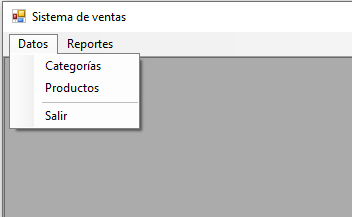
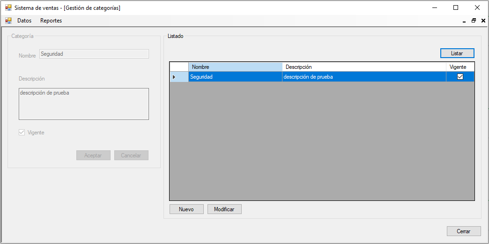
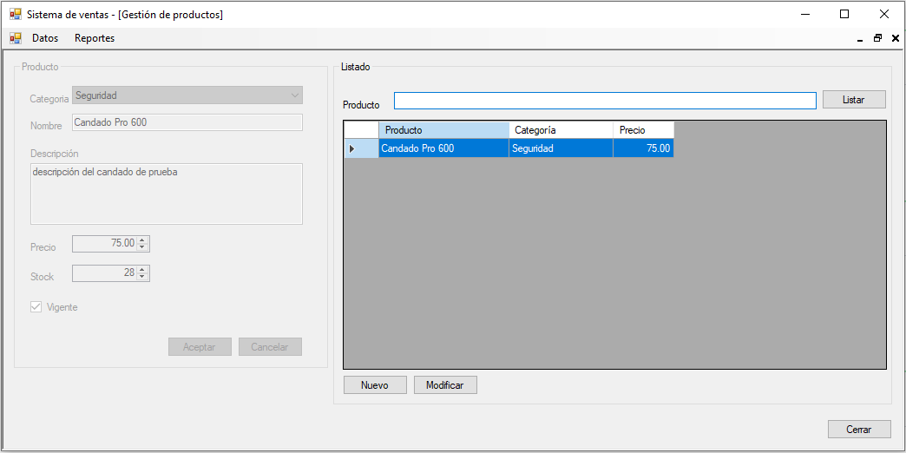
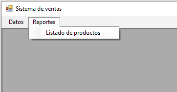
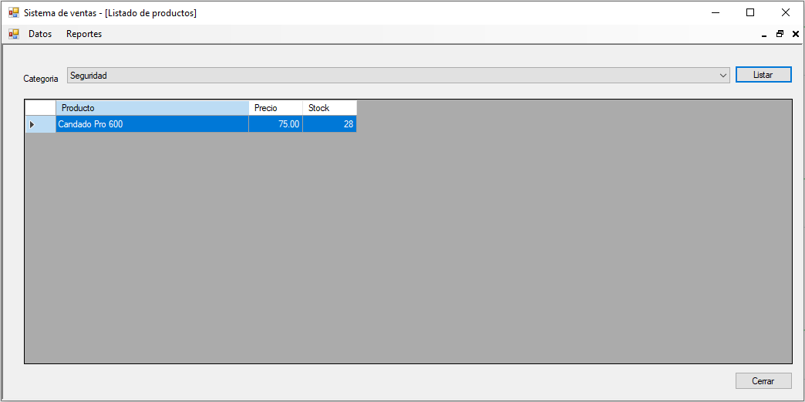

# Gestión de productos
Sistema de gestión de productos en una tienda donde podemos gestionar categoría que permite registrar, modificar y listar categorías, también gestionar producto que permite registrar, modificar y listar productos, en los reportes tenemos listado de productos, **05/10/20**

<strong>Imagen:</strong> Menú de datos.

<strong>Imagen:</strong> Gestión de categorías.

<strong>Imagen:</strong> Gestión de productos.

<strong>Imagen:</strong> Menú de reportes.

<strong>Imagen:</strong> Listado de productos.

